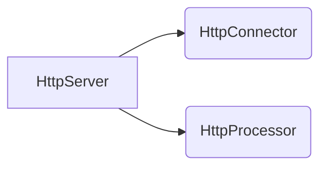


@[TOC]

# 02 初出茅庐:构造一个极简的 HttpServer
使用 Socket 简单实现

## Request
```java
public class Request {

    InputStream input;
    String uri;
    public Request(InputStream input) {
        this.input = input;
    }

    public void parse() {

        int i = 0;
        byte[] buffer = new byte[2024];
        try {
            i = input.read(buffer);
        } catch (IOException e) {
            i = -1;
            throw new RuntimeException(e);
        }

        StringBuilder sb = new StringBuilder();
        for (int j = 0; j < i; j++) {
            sb.append((char) buffer[j]);
        }

        uri = parseUir(sb.toString());
    }

    public String parseUir(String str) {
        int index1 = 0, index2 = 0;

        index1 = str.indexOf(' ');
        index2 = str.indexOf(' ', index1 + 1);
        if (index1 == -1 || index2 == -1) {
            throw new RuntimeException("请求格式异常");
        }

        return str.substring(index1 + 1, index2);
    }

    public String getUri() {
        return uri;
    }
}
```

## Response
```java
public class Response {

    Request request;
    OutputStream out;
    int BUFFER_SIZE = 1024;
    public Response(Request request, OutputStream out) {
        this.request = request;
        this.out = out;
    }

    public void sendStaticResource() {
        byte[] bytes = new byte[BUFFER_SIZE];
        FileInputStream fis = null;
        try {
            File file = new File(HttpServer.WEB_ROOT, request.getUri());
            if (file.exists()) {
                // 在发送文件内容前，先发送成功的HTTP响应头
                String successHeader = "HTTP/1.1 200 OK\r\n"
                        + "Content-Type: text/html\r\n"  // 注意: 这里可以根据文件类型动态改变
                        + "Content-Length: " + file.length() + "\r\n"
                        + "\r\n"; // 重要的空行，分隔头和体
                out.write(successHeader.getBytes(StandardCharsets.UTF_8));
                fis = new FileInputStream(file);
                int ch = fis.read(bytes, 0, BUFFER_SIZE);
                while (ch != -1) {
                    out.write(bytes, 0, ch);
                    ch = fis.read(bytes, 0, BUFFER_SIZE);
                }
                out.flush();
            } else {
                // file not found
                String errorMessage = """
                        HTTP/1.1 404 File Not Found\r
                        Content-Type: text/html\r
                        Content-Length: 23\r
                        \r
                        <h1>File Not Found</h1>""";
                out.write(errorMessage.getBytes());
            }
        } catch (Exception e) {
            // thrown if cannot instantiate a File object
            System.out.println(e.toString());
        } finally {
            if (fis != null){
                try {
                    fis.close();
                } catch (IOException ignored) {

                }
            }
        }
    }
}
```
## HttpServer
```java
public class HttpServer {

    public static final String WEB_ROOT = System.getProperty("user.dir") + File.separator + "webroot";

    public static void main(String[] args) {
        HttpServer httpServer = new HttpServer();
        System.out.println(WEB_ROOT);
        httpServer.await();
    }

    public void await() {
        ServerSocket serverSocket = null;
        int port = 8080;
        try {
            serverSocket = new ServerSocket(port, 1, InetAddress.getByName("127.0.0.1"));
        } catch (IOException e) {
            throw new RuntimeException(e);
        }

        while (true) {
            Socket socket = null;
            InputStream inputStream = null;
            OutputStream outputStream = null;
            try {
                socket = serverSocket.accept();
                inputStream = socket.getInputStream();
                Request request = new Request(inputStream);
                request.parse();

                outputStream = socket.getOutputStream();
                Response response = new Response(request, outputStream);
                response.sendStaticResource();

                socket.close();
            } catch (IOException e) {
                throw new RuntimeException(e);
            }
        }
    }
}
```


# 03 动态 Response : 按照规范构造返回流

```java
    private String composeResponseHead() {
        HashMap<String, String> headers = new HashMap<>();
        headers.put("StatusCode", "200");
        headers.put("StatusName", "ok");
        headers.put("ContentType", "text/html;charset=utf-8");
        headers.put("ZonedDateTime", DateTimeFormatter.ISO_ZONED_DATE_TIME.format(ZonedDateTime.now()));

        return new StrSubstitutor(headers).replace(OKMessage);
    }
    
    //下面的字符串是当文件没有找到时返回的 404 错误描述
    private final static String fileNotFoundMessage = """
            HTTP/1.1 404 File Not Found\r
            Content-Type: text/html\r
            \r
            <h1>File Not Found</h1>
            """;
    //下面的字符串是正常情况下返回的,根据http协议,里面包含了相应的变量。
    private final static String OKMessage = """
            HTTP/1.1 ${StatusCode} ${StatusName}\r
            Content-Type: ${ContentType}\r
            Server: miniTomcat\r
            Date: ${ZonedDateTime}\r
            \r
            """;
```


# 04 各司其职的 Server : 拆分响应模块与处理模块


把 **HttpServer** 拆分成两个部分

* **HttpConnector** : 负责与客户端进行连接
* **HttpProcessor** : 负责分发与处理连接

## HttpConnector 
```java
public class HttpConnector implements Runnable {

    private static final Logger log = LoggerFactory.getLogger(HttpConnector.class);

    @Override
    public void run() {
        ServerSocket serverSocket;
        int port = 8080;
        try {
            serverSocket = new ServerSocket(port, 1, InetAddress.getByName("127.0.0.1"));
            log.info("服务器启动成功");
        } catch (IOException e) {
            throw new RuntimeException(e);
        }

        while (true) {
            try {
                Socket socket = serverSocket.accept();
                HttpProcessor httpProcessor = new HttpProcessor();
                httpProcessor.process(socket);
                socket.close();
            } catch (IOException e) {
                throw new RuntimeException(e);
            }

        }
    }

    public void start() {
        Thread thread = new Thread(this);
        thread.start();
    }
}
```
HttpConnector 实现 Runnable 接口，可以创建多个 HttpConnector 线程，提高并发量


## HttpProcessor
```java
public class HttpProcessor {

    private static final Logger log = LoggerFactory.getLogger(HttpProcessor.class);

    public void process(Socket socket) {
        try {
            InputStream inputStream = socket.getInputStream();
            Request request = new Request(inputStream);
            request.parse();

            OutputStream outputStream = socket.getOutputStream();
            Response response = new Response(request, outputStream);

            if (request.getUri().startsWith("/servlet/")) {
                log.info("访问动态资源");
                ServletProcessor servletProcessor = new ServletProcessor();
                servletProcessor.process(request, response);
            } else {
                StaticResourceProcessor staticResourceProcessor = new StaticResourceProcessor();
                staticResourceProcessor.process(request, response);
            }

            socket.close();
        } catch (IOException e) {
            throw new RuntimeException(e);
        }
    }
}
```

# 05 Server 性能提升: 设计多个 Processor
在上一节中，虽然可以开多个 HttpConnector 线程，但是一个 HttpConnector 只能处理一个 HttpProcessor

在这一节要将 HttpProcessor 异步化

## HttpConnector
```java
public class HttpConnector implements Runnable {

    private static final Logger log = LoggerFactory.getLogger(HttpConnector.class);

    int minProcessors = 3;
    int maxProcessors = 10;
    int curProcessor = 0;
    final Deque<HttpProcessor> processors = new ArrayDeque<>();

    @Override
    public void run() {
        ServerSocket serverSocket;
        int port = 8080;
        try {
            serverSocket = new ServerSocket(port, 1, InetAddress.getByName("127.0.0.1"));
            for (int i = 0; i < minProcessors; i++) {
                HttpProcessor processor = new HttpProcessor(this);
                processor.start();
                processors.add(processor);
            }
            curProcessor = minProcessors;
            log.info("服务器启动成功");
        } catch (IOException e) {
            throw new RuntimeException(e);
        }

        while (true) {
            try {
                Socket socket = serverSocket.accept();
                HttpProcessor processor = getProcessor();
                if (processor == null) {
                    socket.close();
                    log.error("processor 已耗尽");
                } else {
                    processor.assign(socket);
                }
            } catch (IOException e) {
                throw new RuntimeException(e);
            }

        }
    }

    public HttpProcessor getProcessor() {
        synchronized (processors) {
            if (!processors.isEmpty()) {
                return processors.poll();
            } else {
                if (curProcessor < maxProcessors) {
                    curProcessor++;
                    return new HttpProcessor(this);
                }
            }
        }

        return null;
    }

    void recycle(HttpProcessor processor) {
        processors.push(processor);
    }

    public void start() {
        Thread thread = new Thread(this);
        thread.start();
    }
}
```
## HttpProcessor
```java
public class HttpProcessor implements Runnable {

    private static final Logger log = LoggerFactory.getLogger(HttpProcessor.class);

    Socket socket;
    boolean available = false;
    HttpConnector connector;
    public HttpProcessor(HttpConnector connector) {
        this.connector = connector;
    }

    public void start() {
        Thread thread = new Thread(this);
        thread.start();
    }

    @Override
    public void run() {
        while (true) {
            Socket socket = await();
            if (socket == null) {
                continue;
            }
            process(socket);
            try {
                socket.close();
            } catch (IOException e) {
                throw new RuntimeException(e);
            }
            connector.recycle(this);
        }
    }

    public void process(Socket socket) {
        try {
            InputStream inputStream = socket.getInputStream();
            Request request = new Request(inputStream);
            request.parse();

            OutputStream outputStream = socket.getOutputStream();
            Response response = new Response(request, outputStream);

            if (request.getUri().startsWith("/servlet/")) {
                log.info("访问动态资源");
                ServletProcessor servletProcessor = new ServletProcessor();
                servletProcessor.process(request, response);
            } else {
                StaticResourceProcessor staticResourceProcessor = new StaticResourceProcessor();
                staticResourceProcessor.process(request, response);
            }

            socket.close();
        } catch (IOException e) {
            throw new RuntimeException(e);
        }
    }

    synchronized void assign(Socket socket) {
        while (available) {
            try {
                wait();
            } catch (InterruptedException e) {
                throw new RuntimeException(e);
            }
        }
        this.socket = socket;
        available = true;
        notifyAll();
    }

    private synchronized Socket await() {
        while (!available) {
            try {
                wait();
            } catch (InterruptedException e) {
                throw new RuntimeException(e);
            }
        }
        Socket socket = this.socket;
        available = false;
        notifyAll();
        return (socket);
    }
}

```
首先看 assign(socket) 方法,在这里,我们用一个标志available来标记,如果标志为true,  Connetor线程就继续死等。到了某个时候,Processor线程把这个标志设置为false,Connector线  程就跳出死等的循环,然后把接收到的Socket交给Processor。然后要立刻重新把available标志设  置为true,再调用 notifyAll() 通知其他线程。  

再看 await() ,这是作为接收者Processor的线程使用的方法。反过来,如果avaliable标志为  false,那么Processor线程继续死等。到了某个时候,Connector线把这个标志设置为true,那么  Processor线程就跳出死等的循环,拿到Socket。然后要立刻重新把avaiable标志设置为false,再调  用 notifyAll() 通知其他线程。  这个线程互锁机制保证了两个线程之间的同步协调。图示如下:


我们再回顾一下HttpProcessor类中的assign方法与await方法。在HttpProcessor的线程启动之后,  available的标识一直是false,这个时候这个线程会一直等待。在HttpConnector类里构造  Processor,并且调用 processor.assign(socket) 给HttpProcessor分配Socket之后,标识符  available改成true,并且调用notifyAll这个本地方法通知唤醒所有等待的线程。 

 而在await方法里,HttpProcessor拿到HttpConnector传来的Socket之后,首先会接收Socket,并  且立即把available由true改为false,最后以拿到的这个Socket为基准继续进行Processor中的处理  工作。

这也意味着,一旦Connector分配了一个Socket给到Processor,后者就能立即结束等待,拿到  Socket后调用Process方法继续后面的工作。这时available的状态立刻修改,进而用notifyAll方法唤  醒  Connector的等待线程,Connector就可以全身而退,去处理下一个HttpProcessor了。

T omcat中两个线程互锁的这种机制很经典,在后续版本的NIO和Servlet协调的设计中都用到了。  

这样也就做到了HttpProcessor的异步化,也正因为做到了异步化,我们就不能再利用Connector去  关闭Socket了,因为Connector是不知道Processor何时处理完毕的,Socket的关闭任务就交给  Processor自己处理了。


# 06 规范化: 引入 HttpRequest 与 HttpResponse


HttpRequestLine 负责 `method` 、 `uri`、  `protocol`
eq：`GET /hello.txt HTTP/1.1`

HttpHeader 负责其他请求头

SocketInputStream 负责解析请求头

HttpRequest 负责存储请求头

## HttpRequest

```java
public class HttpRequest implements HttpServletRequest {

    private static final Logger log = LoggerFactory.getLogger(HttpRequest.class);

    private InputStream input;
    private SocketInputStream sis;
    private String uri;
    InetAddress address;
    int port;
    protected HashMap<String, String> headers = new HashMap<>();
    protected Map<String, String> parameters = new ConcurrentHashMap<>();
    HttpRequestLine requestLine = new HttpRequestLine();

    public HttpRequest(InputStream input) {
        this.input = input;
        this.sis = new SocketInputStream(this.input, 2048);
    }

    public void parse(Socket socket) {
        try {
            parseConnection(socket);
            this.sis.readRequestLine(requestLine);
            parseHeaders();
        } catch (IOException | ServletException e) {
            log.error(e.getMessage());
        }
        this.uri = new String(requestLine.uri, 0, requestLine.uriEnd);
    }

    private void parseConnection(Socket socket) {
        address = socket.getInetAddress();
        port = socket.getPort();
    }

    private void parseHeaders() throws IOException, ServletException {
        while (true) {
            HttpHeader header = new HttpHeader();
            sis.readHeader(header);
            if (header.nameEnd == 0) {
                if (header.valueEnd == 0) {
                    return;
                } else {
                    throw new ServletException("httpProcessor.parseHeaders.colon");
                }
            }
            String name = new String(header.name,0, header.nameEnd);
            String value = new String(header.value, 0, header.valueEnd);
            // Set the corresponding request headers
            if (name.equals(DefaultHeaders.ACCEPT_LANGUAGE_NAME)) {
                headers.put(name, value);
            } else if (name.equals(DefaultHeaders.CONTENT_LENGTH_NAME)) {
                headers.put(name, value);
            } else if (name.equals(DefaultHeaders.CONTENT_TYPE_NAME)) {
                headers.put(name, value);
            } else if (name.equals(DefaultHeaders.HOST_NAME)) {
                headers.put(name, value);
            } else if (name.equals(DefaultHeaders.CONNECTION_NAME)) {
                headers.put(name, value);
            } else if (name.equals(DefaultHeaders.TRANSFER_ENCODING_NAME)) {
                headers.put(name, value);
            } else {
                headers.put(name, value);
            }
        }
    }

}
```


## SocketInputStream
```java
public class SocketInputStream extends InputStream {

    private static final byte CR = (byte) '\r';
    private static final byte LF = (byte) '\n';
    private static final byte SP = (byte) ' ';
    private static final byte HT = (byte) '\t';
    private static final byte COLON = (byte) ':';
    private static final int LC_OFFSET = 'A' - 'a';
    private static final Logger log = LoggerFactory.getLogger(SocketInputStream.class);

    protected byte[] buf;
    protected int count;
    protected int pos;
    protected InputStream is;

    public SocketInputStream(InputStream is, int bufferSize) {
        this.is = is;
        this.buf = new byte[bufferSize];
    }

    public void readRequestLine(HttpRequestLine requestLine)
            throws IOException {

        int chr = 0;
        do {
            try {
                chr = read();
            } catch (IOException e) {
                log.error(e.getMessage(), e);
            }
        } while ((chr == CR) || (chr == LF));
        pos--;

        int maxRead = requestLine.method.length;
        int readStart = pos;
        int readCount = 0;
        boolean space = false;
        while (!space) {
            if (pos >= count) {
                int val = read();
                if (val == -1) {
                    throw new IOException("requestStream.readline.error");
                }
                pos = 0;
                readStart = 0;
            }
            if (buf[pos] == SP) {
                space = true;
            }
            requestLine.method[readCount] = (char) buf[pos];
            readCount++;
            pos++;
        }
        requestLine.methodEnd = readCount - 1;
        maxRead = requestLine.uri.length;
        readStart = pos;
        readCount = 0;

        space = false;

        boolean eol = false;
        while (!space) {
            if (pos >= count) {
                int val = read();
                if (val == -1)
                    throw new IOException("requestStream.readline.error");
                pos = 0;
                readStart = 0;
            }
            if (buf[pos] == SP) {
                space = true;
            }
            requestLine.uri[readCount] = (char) buf[pos];
            readCount++;
            pos++;
        }

        requestLine.uriEnd = readCount - 1;
        maxRead = requestLine.protocol.length;
        readStart = pos;
        readCount = 0;

        while (!eol) {
            if (pos >= count) {
                int val = read();
                if (val == -1)
                    throw new IOException("requestStream.readline.error");
                pos = 0;
                readStart = 0;
            }
            if (buf[pos] == CR) {
                // Skip CR.
            } else if (buf[pos] == LF) {
                eol = true;
            } else {
                requestLine.protocol[readCount] = (char) buf[pos];
                readCount++;
            }
            pos++;
        }

        requestLine.protocolEnd = readCount;
    }

    public void readHeader(HttpHeader header)
            throws IOException {

        int chr = read();
        if ((chr == CR) || (chr == LF)) { // Skipping CR
            if (chr == CR)
                read(); // Skipping LF
            header.nameEnd = 0;
            header.valueEnd = 0;
            return;
        } else {
            pos--;
        }

        // Reading the header name
        int maxRead = header.name.length;
        int readStart = pos;
        int readCount = 0;

        boolean colon = false;

        while (!colon) {
            // We're at the end of the internal buffer
            if (pos >= count) {
                int val = read();
                if (val == -1) {
                    throw new IOException("requestStream.readline.error");
                }
                pos = 0;
                readStart = 0;
            }
            if (buf[pos] == COLON) {
                colon = true;
            }
            char val = (char) buf[pos];
            if ((val >= 'A') && (val <= 'Z')) {
                val = (char) (val - LC_OFFSET);
            }
            header.name[readCount] = val;
            readCount++;
            pos++;
        }

        header.nameEnd = readCount - 1;

        // Reading the header value (which can be spanned over multiple lines)
        maxRead = header.value.length;
        readStart = pos;
        readCount = 0;

        int crPos = -2;

        boolean eol = false;
        boolean validLine = true;

        while (validLine) {
            boolean space = true;

            // Skipping spaces
            // Note : Only leading white spaces are removed. Trailing white
            // spaces are not.
            while (space) {
                // We're at the end of the internal buffer
                if (pos >= count) {
                    // Copying part (or all) of the internal buffer to the line
                    // buffer
                    int val = read();
                    if (val == -1)
                        throw new IOException("requestStream.readline.error");
                    pos = 0;
                    readStart = 0;
                }
                if ((buf[pos] == SP) || (buf[pos] == HT)) {
                    pos++;
                } else {
                    space = false;
                }
            }

            while (!eol) {
                // We're at the end of the internal buffer
                if (pos >= count) {
                    // Copying part (or all) of the internal buffer to the line
                    // buffer
                    int val = read();
                    if (val == -1)
                        throw new IOException("requestStream.readline.error");
                    pos = 0;
                    readStart = 0;
                }
                if (buf[pos] == CR) {
                } else if (buf[pos] == LF) {
                    eol = true;
                } else {
                    // FIXME : Check if binary conversion is working fine
                    int ch = buf[pos] & 0xff;
                    header.value[readCount] = (char) ch;
                    readCount++;
                }
                pos++;
            }

            int nextChr = read();

            if ((nextChr != SP) && (nextChr != HT)) {
                pos--;
                validLine = false;
            } else {
                eol = false;
                header.value[readCount] = ' ';
                readCount++;
            }

        }

        header.valueEnd = readCount;
    }

    @Override
    public int available() throws IOException {
        return (count - pos) + is.available();
    }

    @Override
    public void close() throws IOException {
        if (is == null) {
            return;
        }
        is.close();
        is = null;
        buf = null;
    }

    @Override
    public int read() throws IOException {
        if (pos >= count) {
            fill();
            if (pos >= count) {
                return -1;
            }
        }
        return buf[pos++] & 0xFF;
    }

    protected void fill() {
        int nRead;
        try {
            nRead = is.read(buf, 0, buf.length);
        } catch (IOException e) {
            throw new RuntimeException(e);
        }
        pos = 0;
        count = 0;
        if (nRead > 0) {
            count = nRead;
        }
    }
}
```
pos：在 buf 中要读的位置
count: 在 buf 的末尾
buf 是一个缓存，is 会不断将数据输入到 buf 中
在 `read()` 方法中，当 `pos >= count` 时，说明 buf 中的数据已经使用完毕，通过 is 读取下一批数据并缓存在 buf 中，否则会将返回当前位置的数据，并将 pos++

# 07 对内的保护: 引入门面模式封装内部实现类

在HttpProcessor类里,我们直接使用的是HttpRequest与HttpResponse,  这两个对象要传入Servlet里,但在这两个类中我们也定义了许多内部的方法,一旦被用户知晓我们  的实现类,那么这些内部方法就暴露在用户面前了,这是我们不愿看到的,也是我们需要规避的。  因此这节课我们计划用⻔面(Facade)设计模式来解决这个问题

## HttpRequestFacade
```java
public class HttpRequestFacade implements HttpServletRequest {
    private HttpServletRequest request;

    public HttpRequestFacade(HttpRequest request) {
        this.request = request;
    }

    /* implementation of the HttpServletRequest*/
    public Object getAttribute(String name) {
        return request.getAttribute(name);
    }

    public Enumeration getAttributeNames() {
        return request.getAttributeNames();
    }

    public String getAuthType() {
        return request.getAuthType();
    }

    public String getCharacterEncoding() {
        return request.getCharacterEncoding();
    }

    public int getContentLength() {
        return request.getContentLength();
    }

    public String getContentType() {
        return request.getContentType();
    }

    public String getContextPath() {
        return request.getContextPath();
    }

    public Cookie[] getCookies() {
        return request.getCookies();
    }

    public long getDateHeader(String name) {
        return request.getDateHeader(name);
    }

    public Enumeration getHeaderNames() {
        return request.getHeaderNames();
    }

    public String getHeader(String name) {
        return request.getHeader(name);
    }

    public Enumeration getHeaders(String name) {
        return request.getHeaders(name);
    }

    public ServletInputStream getInputStream() throws IOException {
        return request.getInputStream();
    }

    public int getIntHeader(String name) {
        return request.getIntHeader(name);
    }

    public Locale getLocale() {
        return request.getLocale();
    }

    public Enumeration getLocales() {
        return request.getLocales();
    }

    public String getMethod() {
        return request.getMethod();
    }

    public String getParameter(String name) {
        return request.getParameter(name);
    }

    public Map getParameterMap() {
        return request.getParameterMap();
    }

    public Enumeration getParameterNames() {
        return request.getParameterNames();
    }

    public String[] getParameterValues(String name) {
        return request.getParameterValues(name);
    }

    public String getPathInfo() {
        return request.getPathInfo();
    }

    public String getPathTranslated() {
        return request.getPathTranslated();
    }

    public String getProtocol() {
        return request.getProtocol();
    }

    public String getQueryString() {
        return request.getQueryString();
    }

    public BufferedReader getReader() throws IOException {
        return request.getReader();
    }

    public String getRealPath(String path) {
        return request.getRealPath(path);
    }
}
```

## HttpResponseFacade
```java
public class HttpResponseFacade implements HttpServletResponse {
    private HttpServletResponse response;
    public HttpResponseFacade(HttpResponse response) {
        this.response = response;
    }

    public void addDateHeader(String name, long value) {
        response.addDateHeader(name, value);
    }

    public void addHeader(String name, String value) {
        response.addHeader(name, value);
    }

    public void addIntHeader(String name, int value) {
        response.addIntHeader(name, value);
    }

    public boolean containsHeader(String name) {
        return response.containsHeader(name);
    }

    public String encodeRedirectURL(String url) {
        return response.encodeRedirectURL(url);
    }

    public String encodeRedirectUrl(String url) {
        return response.encodeRedirectUrl(url);
    }

    public String encodeUrl(String url) {
        return response.encodeUrl(url);
    }

    public String encodeURL(String url) {
        return response.encodeURL(url);
    }

    public void flushBuffer() throws IOException {
        response.flushBuffer();
    }

    public int getBufferSize() {
        return response.getBufferSize();
    }

    public String getCharacterEncoding() {
        return response.getCharacterEncoding();
    }
}
```

最后修改 ServletProcessor

```java
    public void process(HttpRequest request, HttpResponse response) {
        String uir = request.getUri();
        String ServletName = uir.substring(uir.lastIndexOf('/') + 1);
        URLClassLoader loader;

        try {
            URL[] urls = new URL[1];
            File classPath = new File(HttpServer.WEB_ROOT);
            String repository = (new URL("file", null, classPath.getCanonicalPath() + File.separator)).toString();
            URLStreamHandler urlStreamHandler = null;
            urls[0] = new URL(null, repository, urlStreamHandler);
            loader = new URLClassLoader(urls);
        } catch (IOException e) {
            throw new RuntimeException(e);
        }

        ServletName = "com.lbwxxc.test.HelloServlet";
        Class<?> servletClass;
        ClassLoader classLoader = this.getClass().getClassLoader();
        try {
            servletClass = classLoader.loadClass(ServletName);
        } catch (ClassNotFoundException e) {
            throw new RuntimeException(e);
        }

        PrintWriter writer;
        try {
            writer = response.getWriter();
            writer.println(composeResponseHead());
        } catch (IOException e) {
            throw new RuntimeException(e);
        }
        HttpRequestFacade httpRequestFacade = new HttpRequestFacade(request);
        HttpResponseFacade httpResponseFacade = new HttpResponseFacade(response);
        Servlet servlet;
        try {
            servlet = (Servlet) servletClass.newInstance();
            servlet.service(httpRequestFacade, httpResponseFacade);
        } catch (InstantiationException | IllegalAccessException | ServletException | IOException e) {
            throw new RuntimeException(e);
        }

    }
```

这样在Servlet中,我们看到的只是Facade,看不⻅内部方法,应用程序员想进行强制转化也不行,  这样既简单又安全。 
 
还有,按照Servlet的规范,客户自定义的Servlet是要继承HttpServlet的,在调用的service方法  内,它的实际行为是通过method判断调用的是哪一个方法,如果是Get方法就调用doGet(),如果是  Post方法调用的就是doPost(),其他的方法也是一样的道理。  

所以在我们自定义的HttpRequest里,一定要实现getMethod方法,我们来调整一下。

```java
    public String getMethod() {
        return new String(requestLine.method, 0, requestLine.methodEnd);
    }
```

# 08 解析参数:通过引入 Cookie 和 Session 避免反复登录
Cookie 可能存放在请求行或者请求头，所以在解析 HttpRequest 时，要分别处理
```java
    public void parseRequestLine() {
        int queryStart = requestLine.indexOf("?");
        if (queryStart >= 0) {
            queryString = new String(requestLine.uri, queryStart + 1, requestLine.uriEnd - queryStart - 1);
            uri = new String(requestLine.uri, 0, queryStart);
            int semicolon = uri.indexOf(DefaultHeaders.JSESSIONID_NAME);
            if (semicolon >= 0) {
                sessionid = uri.substring(semicolon + DefaultHeaders.JSESSIONID_NAME.length());
                uri = uri.substring(0, semicolon);
            }
        } else {
            queryString = null;
            uri = new String(requestLine.uri, 0, requestLine.uriEnd);
            int  semicolon = uri.indexOf(DefaultHeaders.JSESSIONID_NAME);
            if (semicolon >= 0) {
                sessionid = uri.substring(semicolon + DefaultHeaders.JSESSIONID_NAME.length());
                uri = uri.substring(0, semicolon);
            }
        }
    }
```
```java
    private void parseHeaders() throws IOException, ServletException {
        while (true) {
            HttpHeader header = new HttpHeader();
            sis.readHeader(header);
            if (header.nameEnd == 0) {
                if (header.valueEnd == 0) {
                    return;
                } else {
                    throw new ServletException("httpProcessor.parseHeaders.colon");
                }
            }
            String name = new String(header.name,0, header.nameEnd);
            String value = new String(header.value, 0, header.valueEnd);
            // Set the corresponding request headers
            if (name.equals(DefaultHeaders.ACCEPT_LANGUAGE_NAME)) {
                headers.put(name, value);
            } else if (name.equals(DefaultHeaders.CONTENT_LENGTH_NAME)) {
                headers.put(name, value);
            } else if (name.equals(DefaultHeaders.CONTENT_TYPE_NAME)) {
                headers.put(name, value);
            } else if (name.equals(DefaultHeaders.HOST_NAME)) {
                headers.put(name, value);
            } else if (name.equals(DefaultHeaders.CONNECTION_NAME)) {
                headers.put(name, value);
            } else if (name.equals(DefaultHeaders.TRANSFER_ENCODING_NAME)) {
                headers.put(name, value);
            } else if (name.equals(DefaultHeaders.COOKIE_NAME)) {
                headers.put(name, value);
                this.cookies = parseCookieHeader(value);
                for (int i = 0; i < cookies.length; i++) {
                    if (cookies[i].getName().equals("jsessionid")) {
                        this.sessionid = cookies[i].getValue();
                    }
                }
            } else {
                headers.put(name, value);
            }
        }
    }
```
解析完 HttpRequest，会尝试获取 session，如果没有最会创建，并存放在 HttpConnect
```java
    public void process(Socket socket) {
        try {
            InputStream inputStream = socket.getInputStream();
            HttpRequest httpRequest = new HttpRequest(inputStream);
            httpRequest.parse(socket);
            if (httpRequest.getSessionid() == null || httpRequest.getSessionid().isEmpty()) {
                // 尝试获取 session，如果没有则创建
                httpRequest.getSession(true);
            }
            OutputStream outputStream = socket.getOutputStream();
            HttpResponse httpResponse = new HttpResponse(outputStream);
            httpResponse.setRequest(httpRequest);
            if (httpRequest.getUri().startsWith("/servlet/")) {
                log.info("访问动态资源");
                ServletProcessor servletProcessor = new ServletProcessor();
                servletProcessor.process(httpRequest, httpResponse);
            } else {
                StaticResourceProcessor staticResourceProcessor = new StaticResourceProcessor();
                staticResourceProcessor.process(httpRequest, httpResponse);
            }

            socket.close();
        } catch (IOException e) {
            throw new RuntimeException(e);
        }
    }
```
```java
    public HttpSession getSession(boolean b) {
        if (sessionFacade != null)
            return sessionFacade;
        if (sessionid != null) {
            session = HttpConnector.sessions.get(sessionid);
            if (session != null) {
                sessionFacade = new SessionFacade(session);
                return sessionFacade;
            } else {
                session = HttpConnector.createSession();
                sessionFacade = new SessionFacade(session);
                return sessionFacade;
            }
        } else {
            session = HttpConnector.createSession();
            sessionFacade = new SessionFacade(session);
            sessionid = session.getId();
            return sessionFacade;
        }
    }
```
```java
    public static Session createSession() {
        Session session = new Session();
        session.setValid(true);
        session.setCreationTime(System.currentTimeMillis());
        String sessionId = generateSessionId();
        session.setId(sessionId);
        sessions.put(sessionId, session);
        return (session);
    }
```
# 09 有状态的 Response: 实现 Session 传递与 keep-alive 
```java
    public void sendHeaders() throws IOException {
        PrintWriter outputWriter = getWriter();
        outputWriter.print(this.getProtocol());
        outputWriter.print(" ");
        outputWriter.print(status);
        if (message != null) {
            outputWriter.print(" ");
            outputWriter.print(message);
        }
        outputWriter.print("\r\n");
        if (getContentType() != null) {
            outputWriter.print("Content-Type: " + getContentType() + "\r\n");
        }
        if (getContentLength() >= 0) {
            outputWriter.print("Content-Length: " + getContentLength() + "\r\n");
        }
        Iterator<String> names = headers.keySet().iterator();
        while (names.hasNext()) {
            String name = names.next();
            String value = headers.get(name);
            outputWriter.print(name);
            outputWriter.print(": ");
            outputWriter.print(value);
            outputWriter.print("\r\n");
        }

        HttpSession session = this.request.getSession(false);
        if (session != null) {
            Cookie cookie = new Cookie(DefaultHeaders.JSESSIONID_NAME, session.getId());
            cookie.setMaxAge(-1);
            addCookie(cookie);
        }

        synchronized (cookies) {
            Iterator<Cookie> items = cookies.iterator();
            while (items.hasNext()) {
                Cookie cookie = items.next();
                outputWriter.print(CookieTools.getCookieHeaderName(cookie));
                outputWriter.print(": ");
                StringBuffer sbValue = new StringBuffer();
                CookieTools.getCookieHeaderValue(cookie, sbValue);
                log.info("set cookie jsessionid string : {}", sbValue);
                outputWriter.print(sbValue);
                outputWriter.print("\r\n");
            }
        }

        outputWriter.print("\r\n");
        outputWriter.flush();
    }
```
在正式处理请求前，会先把 response 头写入到流中

## bug

在 ServletProcessor 多添加了一个响应头

```java
    public void process(HttpRequest request, HttpResponse response) {
        String uir = request.getUri();
        String ServletName = uir.substring(uir.lastIndexOf('/') + 1);
        URLClassLoader loader = HttpConnector.loader;


        ServletName = "com.lbwxxc.test.HelloServlet";
        Class<?> servletClass;
        ClassLoader classLoader = this.getClass().getClassLoader();
        try {
            servletClass = classLoader.loadClass(ServletName);
        } catch (ClassNotFoundException e) {
            throw new RuntimeException(e);
        }

//        PrintWriter writer;
//        try {
//            writer = response.getWriter();
//            writer.println(composeResponseHead());
//        } catch (IOException e) {
//            throw new RuntimeException(e);
//        }
        HttpRequestFacade httpRequestFacade = new HttpRequestFacade(request);
        HttpResponseFacade httpResponseFacade = new HttpResponseFacade(response);
        Servlet servlet;
        try {
            servlet = (Servlet) servletClass.newInstance();
            servlet.service(httpRequestFacade, httpResponseFacade);
        } catch (InstantiationException | IllegalAccessException | ServletException | IOException e) {
            throw new RuntimeException(e);
        }

    }
```

# 10 Servlet Wrapper: 如何维护 Servlet 生命周期及实现容器管理?
Wrapper 是对 Servlet 的封装
```java
public class ServletWrapper {
    private Servlet instance = null;
    private String servletClass;
    private ClassLoader loader;
    private String name;
    protected ServletContainer parent = null;

    public ServletWrapper(String servletClass, ServletContainer parent) {
        this.parent = parent;
        this.servletClass = servletClass;

        //loadServlet();
    }

    public ClassLoader getLoader() {
        if (loader != null)
            return loader;
        return parent.getLoader();
    }
    public String getServletClass() {
        return servletClass;
    }
    public void setServletClass(String servletClass) {
        this.servletClass = servletClass;
    }
    public ServletContainer getParent() {
        return parent;
    }
    public void setParent(ServletContainer container) {
        parent = container;
    }
    public Servlet getServlet(){
        return this.instance;
    }

    public Servlet loadServlet() throws ServletException {
        if (instance!=null)
            return instance;
        Servlet servlet = null;
        String actualClass = servletClass;
        if (actualClass == null) {
            throw new ServletException("servlet class has not been specified");
        }
        ClassLoader classLoader = getLoader();
        Class classClass = null;
        try {
            if (classLoader!=null) {
                classClass = classLoader.loadClass(actualClass);
            }
        }
        catch (ClassNotFoundException e) {
            throw new ServletException("Servlet class not found");
        }
        try {
            servlet = (Servlet) classClass.newInstance();
        }
        catch (Throwable e) {
            throw new ServletException("Failed to instantiate servlet");
        }

        try {
            servlet.init(null);
        }
        catch (Throwable f) {
            throw new ServletException("Failed initialize servlet.");
        }
        instance = servlet;
        return servlet;
    }

    public void invoke(HttpServletRequest request, HttpServletResponse response)
            throws IOException, ServletException {
        if (instance != null) {
            instance.service(request, response);
        }
    }
}
```

创建 ServletContainer 专门管理 Wrapper
```java
public class ServletContainer {
    HttpConnector connector;
    ClassLoader loader;

    Map<String, String> servletClsMap = new ConcurrentHashMap<>();
    Map<String, ServletWrapper> servletInstanceMap = new ConcurrentHashMap<>();

    public ServletContainer() {
        URL[] urls = new URL[1];
        URLStreamHandler streamHandler = null;
        File classPath = new File("target/classes/com/lbwxxc/test");
        try {
            String repository = (new URL("file", null,  classPath.getCanonicalPath() + File.separator)).toString();
            urls[0] = new URL(null, repository, streamHandler);
            loader = new URLClassLoader(urls);
        } catch (IOException e) {
            throw new RuntimeException(e);
        }
    }

    public void invoke(HttpRequest request, HttpResponse response) {
        ServletWrapper servlet = null;
        ClassLoader loader = getLoader();
        String uri = request.getUri();
        String servletName = uri.substring(uri.lastIndexOf("/") + 1);
        String servletClassName = servletName;
        servlet = servletInstanceMap.get(servletName);


        if (servlet == null) {
            Class<?> servletClass = null;
            try {
                servletClass =  loader.loadClass("com.lbwxxc.test.HelloServlet");
            } catch (ClassNotFoundException e) {
                throw new RuntimeException(e);
            }

            try {
                servlet = new ServletWrapper(servletClassName, this);
                servlet.setInstance((Servlet) servletClass.newInstance());
            } catch (InstantiationException | IllegalAccessException e) {
                throw new RuntimeException(e);
            }

            servletClsMap.put(servletName, servletClassName);
            servletInstanceMap.put(servletName, servlet);
        }

        try {
            HttpRequestFacade requestFacade = new HttpRequestFacade(request);
            HttpResponseFacade responseFacade = new HttpResponseFacade(response);
            System.out.println("Call service()");
            servlet.invoke(requestFacade, responseFacade);
        } catch (ServletException | IOException e) {
            throw new RuntimeException(e);
        }
    }
}
```
让 HttpConnector 与  ServletContainer 相互引用
```java
        HttpConnector httpConnector = new HttpConnector();
        ServletContainer servletContainer = new ServletContainer();
        httpConnector.setContainer(servletContainer);
        servletContainer.setConnector(httpConnector);
        httpConnector.start();
```

在 ServletProcessor 直接调用 ServletContainer ，实现责任分离

```java
    private HttpConnector connector;
    public ServletProcessor(HttpConnector connector) {
        this.connector = connector;
    }
```

# 11 多层容器:如何通过实现 Context 与 Wrapper 形成多层容器?

```java
public abstract class ContainerBase implements Container {
    protected Map<String, Container> children = new ConcurrentHashMap<>();
    protected ClassLoader loader = null;
    protected String name = null;
    protected Container parent = null;

    public abstract String getInfo();
    public ClassLoader getLoader() {
        if (loader != null)
            return (loader);
        if (parent != null)
            return (parent.getLoader());
        return (null);
    }

    public synchronized void setLoader(ClassLoader loader) {
        ClassLoader oldLoader = this.loader;
        if (oldLoader == loader) {
            return;
        }
        this.loader = loader;
    }

    public String getName() {
        return (name);
    }


    public void setName(String name) {
        this.name = name;
    }

    public Container getParent() {
        return (parent);
    }


    public void setParent(Container container) {
        Container oldParent = this.parent;
        this.parent = container;
    }


    public void addChild(Container child) {
        addChildInternal(child);
    }

    private void addChildInternal(Container child) {
        synchronized(children) {
            if (children.get(child.getName()) != null)
                throw new IllegalArgumentException("addChild:  Child name '" +
                        child.getName() +
                        "' is not unique");
            child.setParent((Container) this);  // May throw IAE
            children.put(child.getName(), child);
        }
    }

    public Container findChild(String name) {
        if (name == null)
            return (null);
        synchronized (children) {       // Required by post-start changes
            return ((Container) children.get(name));
        }

    }


    public Container[] findChildren() {

        synchronized (children) {
            Container results[] = new Container[children.size()];
            return ((Container[]) children.values().toArray(results));
        }

    }

    public void removeChild(Container child) {

        synchronized(children) {
            if (children.get(child.getName()) == null)
                return;
            children.remove(child.getName());
        }
        child.setParent(null);
```
多层容器

# 12 Pipeline 与 Valve: 如何实现容器间的调用、事务管理、权限验证?
使用责任链


# Filter 与 Listener: 如何实现过滤和持续监听?
## 过滤器

```java
final class ApplicationFilterChain implements FilterChain {

    public ApplicationFilterChain() {
        super();
    }
    private ArrayList<ApplicationFilterConfig> filters = new ArrayList<>();

    private Iterator<ApplicationFilterConfig> iterator = null;

    private Servlet servlet = null;

    public void doFilter(ServletRequest request, ServletResponse response)
            throws IOException, ServletException {
        System.out.println("FilterChain doFilter()");
        internalDoFilter(request,response);
    }

    private void internalDoFilter(ServletRequest request, ServletResponse response)
            throws IOException, ServletException {
        // Construct an iterator the first time this method is called
        if (this.iterator == null)
            this.iterator = filters.iterator();

        // Call the next filter if there is one
        if (this.iterator.hasNext()) {
            ApplicationFilterConfig filterConfig =
                    (ApplicationFilterConfig) iterator.next();
            Filter filter = null;
            try {
                filter = filterConfig.getFilter();
                System.out.println("Filter doFilter()");

                filter.doFilter(request, response, this);
            } catch (IOException | ServletException | RuntimeException e) {
                throw e;
            } catch (Throwable e) {
                throw new ServletException("filterChain.filter", e);
            }
            return;
        }

        // We fell off the end of the chain -- call the servlet instance
        try {
            HttpServletRequest requestFacade = new HttpRequestFacade((HttpRequestImpl) request);
            HttpServletResponse responseFacade = new HttpResponseFacade((HttpResponseImpl) response);

            servlet.service(requestFacade, responseFacade);
        } catch (IOException | ServletException | RuntimeException e) {
            throw e;
        } catch (Throwable e) {
            throw new ServletException("filterChain.servlet", e);
        }

    }

    void addFilter(ApplicationFilterConfig filterConfig) {
        this.filters.add(filterConfig);
    }

    void release() {
        this.filters.clear();
        this.iterator = iterator;
        this.servlet = null;
    }

    void setServlet(Servlet servlet) {
        this.servlet = servlet;
    }
}
```

